# OfferPilot

<div align="center">


**面向中文求职用户的 AI 求职准备工作台**

上传 PDF 简历，粘贴目标 JD，系统自动完成 `解析 -> 改写建议 -> 模拟面试`。

[在线体验](https://offerpilot-ai.vercel.app) · [项目仓库](https://github.com/JNHFlow21/offerpilot-ai)

</div>

---

## 产品截图式概览

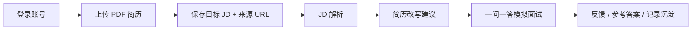

## 为什么做这个产品

OfferPilot 不是一个泛聊天机器人，而是一个围绕真实求职任务设计的 AI 工作台。

它聚焦 4 个高频痛点：

- 简历和目标岗位 JD 脱节，不知道该怎么改
- 面经、知识点、岗位要求分散，越看越乱
- 模拟面试难以持续推进，也缺少逐题反馈
- 用户不想自己折腾 RAG、向量库和知识库配置

## 核心价值

### 对用户

- 只做两件输入：`上传简历`、`提交 JD`
- 不需要配置知识库，平台预置面经与高频问题
- 自动给出改写建议，并直接进入模拟面试

### 对 AI 产品项目包装

- 覆盖 `RAG / Workflow / Prompt / 轻 Agent / Memory`
- 有清晰主路径，不是拼凑式 AI demo
- 可讲产品定位、能力拆分、结构化输出、评测与性能优化

## 产品北极星

> 每周完成一次有效岗位准备闭环的用户数

### 核心指标盘

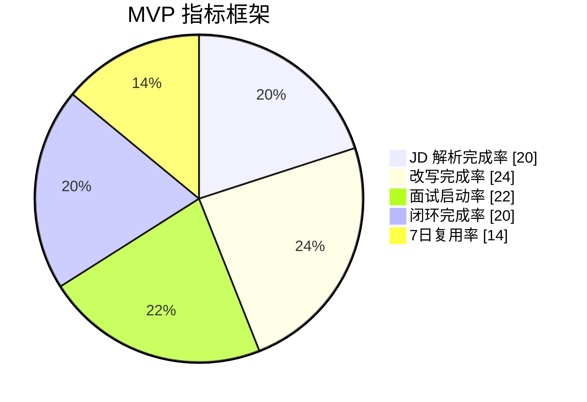

### 体验优先级

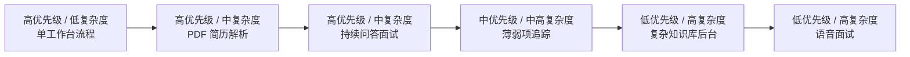

## 当前 MVP 范围

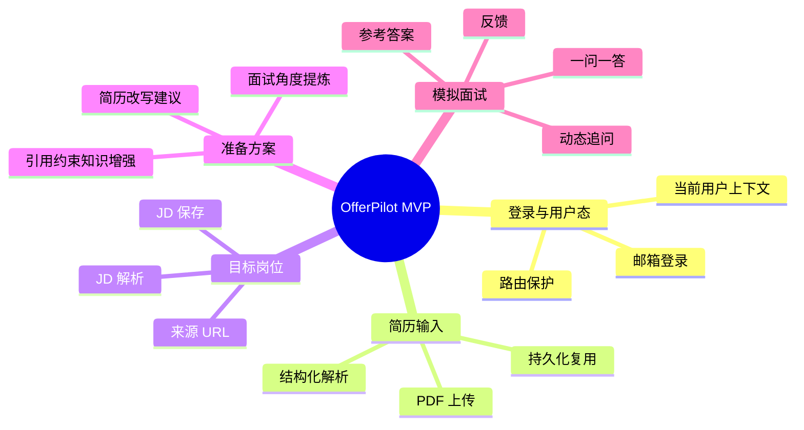

## AI 能力拆分

OfferPilot 不把所有问题都塞给一个“大 Agent”，而是按任务分层。

| 能力层 | 用途 | 在产品中的位置 |
| --- | --- | --- |
| `RAG` | 检索面经、岗位知识、高频问题 | JD 解析增强、改写建议增强、面试问题增强 |
| `Workflow` | 结构化执行固定任务 | PDF 简历解析、JD 解析、改写建议生成 |
| `Prompt` | 限制风格、控制边界、结构化输出 | 改写摘要、问题反馈、参考答案 |
| `轻 Agent` | 多轮提问、动态追问、状态推进 | 一问一答模拟面试 |
| `Memory` | 复用当前用户简历、岗位、会话记录 | 登录后工作台与 session 恢复 |

### 模型分工

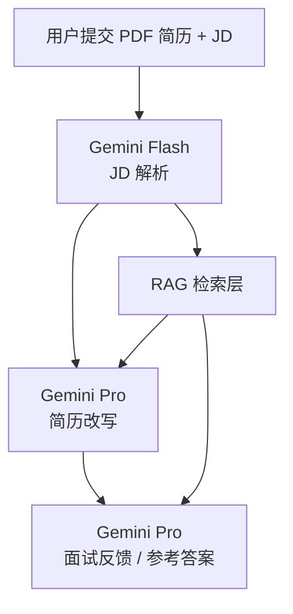

### 为什么这么分

- `Flash` 更适合首屏解析，降低等待时间
- `Pro` 更适合改写建议和面试反馈，保证质量
- 面试不一次性全部生成，而是按 turn 增量推进

## 用户主路径

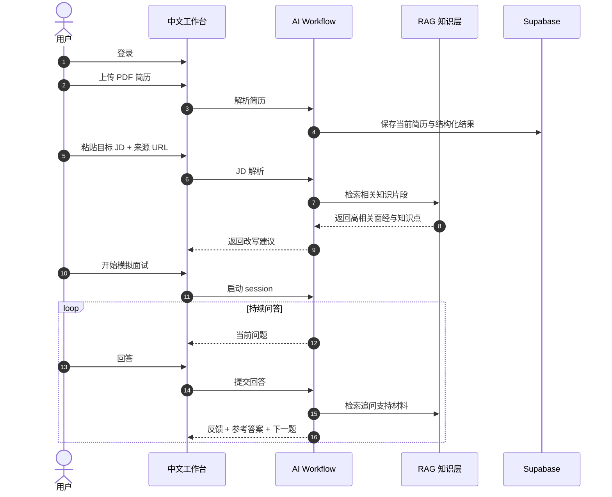

## 系统架构

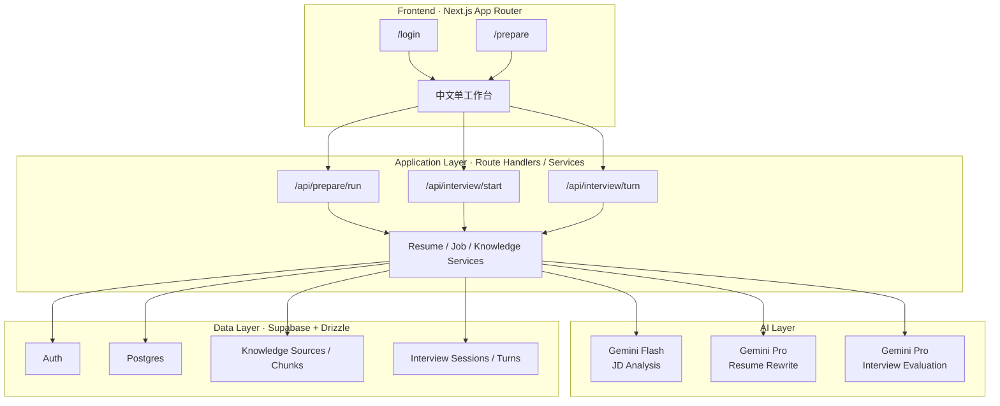

## 当前实现状态

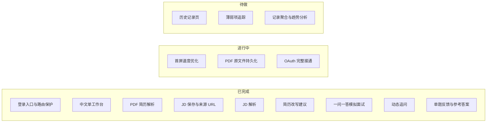

## 技术栈

| 维度 | 方案 |
| --- | --- |
| 前端 | Next.js 15 + React 19 |
| 后端 | Next.js Route Handlers |
| 数据库 | Supabase Postgres |
| 鉴权 | Supabase Auth |
| ORM | Drizzle ORM |
| AI SDK | OpenAI Node SDK（Gemini OpenAI-compatible endpoint） |
| 模型 | Gemini Flash / Gemini Pro |
| 文件解析 | `pdf-parse` + AI 结构化抽取 |
| 校验 | Zod |
| 测试 | Vitest + Testing Library |
| 部署 | Vercel |

## 数据模型总览

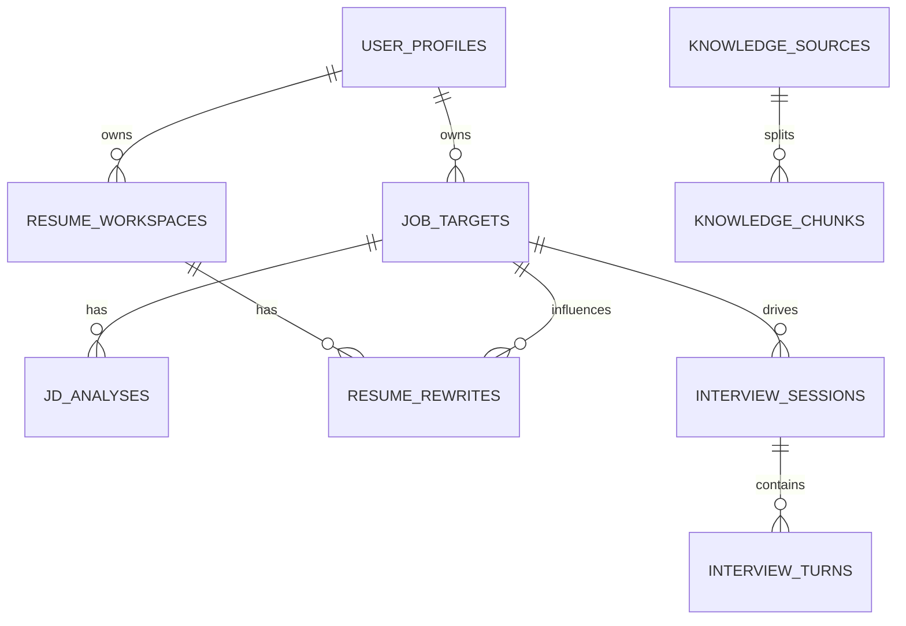

## 代码结构

```text
.
├── app/                    # Next.js 页面与 API 路由
├── components/             # 业务组件与表单
├── lib/
│   ├── ai/                 # prompts / schemas / model client config
│   ├── auth/               # 当前用户与登录态
│   ├── db/                 # Drizzle schema 与 DB client
│   └── services/           # JD、简历、知识、面试 workflow
├── supabase/
│   └── migrations/         # 数据库迁移
├── tests/                  # 单测与集成测试
├── context/                # 项目上下文与开发行程
└── docs/plans/             # PRD、实现计划、云端文档
```

## 本地启动

### 1. 安装依赖

```bash
pnpm install
```

### 2. 配置环境变量

创建 `.env.local`，至少包含：

```bash
DATABASE_URL=postgresql://...
NEXT_PUBLIC_SUPABASE_URL=https://xxxx.supabase.co
NEXT_PUBLIC_SUPABASE_ANON_KEY=sb_publishable_xxxx
GEMINI_API_KEY=your_gemini_key
GEMINI_JD_MODEL=gemini-2.5-flash
GEMINI_REWRITE_MODEL=gemini-3.1-pro-preview
GEMINI_INTERVIEW_MODEL=gemini-3.1-pro-preview
```

### 3. 启动项目

```bash
pnpm dev
```

### 4. 运行测试

```bash
pnpm test
pnpm build
```

## 开发路线图

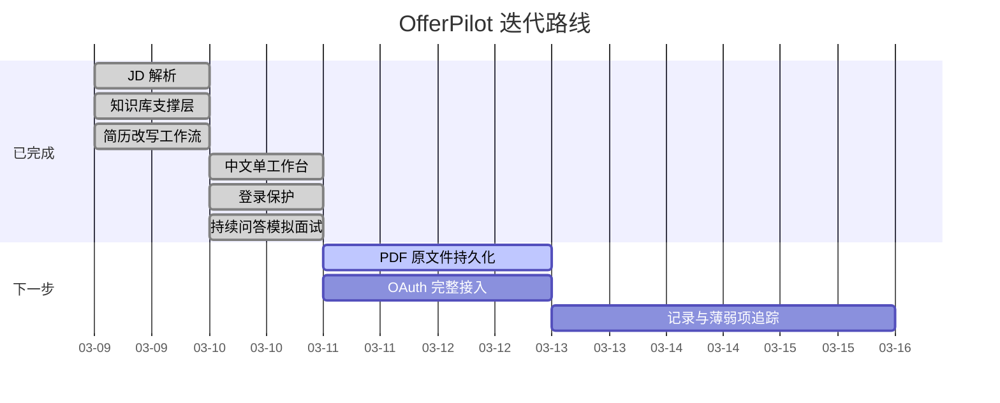

## 适合写进简历的点

- 从 0 到 1 定义中文 AI 求职工作台的产品定位、MVP 范围与主路径
- 将 AI 能力拆分为 `RAG / Workflow / Prompt / 轻 Agent`，而不是做泛聊天壳
- 设计 `简历上传 -> JD 解析 -> 改写建议 -> 模拟面试` 的可执行闭环
- 通过 staged pipeline 和模型分工优化首屏体验与回答质量

## 项目亮点速览

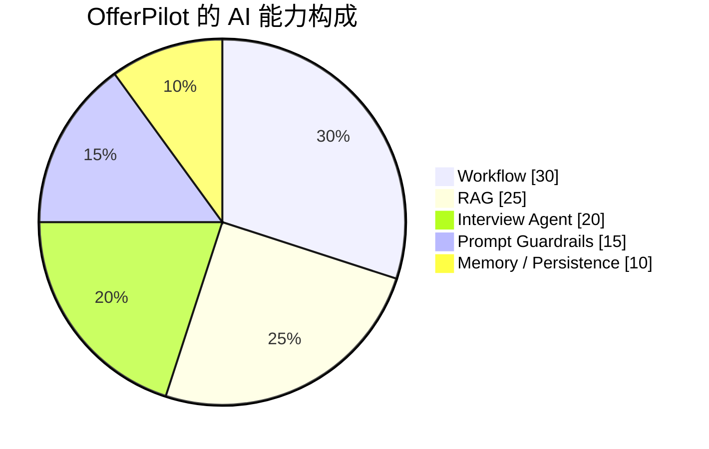

## 相关文档

- [产品上下文](./context/OfferPilot_Product_Context.md)
- [项目行程](./context/OfferPilot_Project_Journey.md)
- [PRD](./docs/plans/2026-03-09-ai-job-interview-assistant-prd.md)
- [设计文档](./docs/plans/2026-03-09-ai-job-interview-assistant-design.md)
- [云端配置](./docs/plans/2026-03-09-offerpilot-cloud-setup.md)

---

<div align="center">

**OfferPilot**

把求职准备从“信息堆积”重构成“可执行的 AI 工作流”。

</div>
