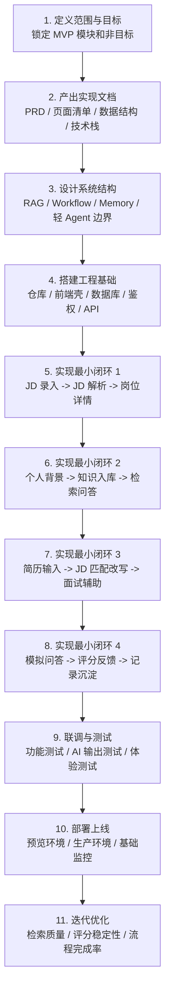

# OfferPilot Project Journey

这份文档用于持续记录 OfferPilot 的开发流程、阶段目标和项目进展。

## 1. 产品开发形态

OfferPilot 当前不是做一个独立运行的“通用 Agent”。

更准确的定义是：

**一个 Web 产品，里面包含 RAG、Workflow、Memory、Prompt，以及后续模拟面试场景下的轻 Agent 能力。**

可以理解为三层：

1. 产品层：`Web 页面 / 用户流程 / 数据记录`
2. AI 能力层：`JD 解析`、`简历改写`、`知识检索问答`、`面试辅助`
3. Agent 层：只在后续 `模拟面试` 模块中承担多轮追问和动态调整

因此，开发对象是一个可使用的网页产品，而不是单独做一个聊天 Agent 壳。

## 2. 完整开发流程图

## 3. 分阶段说明

### 阶段 1：定义范围

目标：

- 明确当前 MVP 主路径是 `简历输入`、`JD 解析`、`简历按 JD 改写`、`面试辅助`
- 明确不做上传解析、语音面试、复杂 Agent 编排

产出：

- 产品背景文档
- 设计文档
- PRD

### 阶段 2：产出实现规格

目标：

- 把概念文档转成可以开发的规格

产出：

- 页面级功能清单
- API 边界
- 数据表结构
- TypeScript schema
- MVP 技术栈方案

### 阶段 3：搭建工程基础

目标：

- 先把产品运行骨架搭起来

包含：

- 初始化独立仓库
- 搭建 Next.js 项目
- 接入 Supabase
- 建立数据库 migration
- 配置 OpenAI 调用层

### 阶段 4：实现业务闭环

按顺序完成 4 条主路径：

1. `JD 解析`
2. `知识库问答（支撑层）`
3. `简历按 JD 改写 + 面试辅助`
4. `模拟面试与记录沉淀`

原则：

- 先打通主路径，再补体验
- 先保证结构化输出稳定，再补 fancy 交互

### 阶段 5：测试与部署

测试分为三层：

1. 功能测试：页面和接口是否走通
2. AI 测试：输出是否稳定、是否可解析、是否低幻觉
3. 产品测试：用户能否完成一轮训练闭环

部署后重点看：

- 岗位解析完成率
- 简历改写完成率
- 面试辅助使用率
- 完整准备闭环完成率
- 平均响应时长

## 4. 开发顺序原则

OfferPilot 的推荐开发顺序：

1. 先写必要文档，不继续做空泛分析
2. 再定数据结构和 AI 输出 schema
3. 然后搭前后端工程壳
4. 再按模块逐个接 AI 能力
5. 最后做联调、测试和部署

对应到代码层就是：

1. `docs`
2. `database schema`
3. `service layer / AI workflows`
4. `frontend pages`
5. `integration`
6. `testing`
7. `deploy`

## 5. 当前项目状态

截至 `2026-03-09`：

- 已完成产品背景文档
- 已完成设计文档
- 已完成 PRD
- 已完成 MVP 页面级功能清单、数据结构设计、技术栈建议
- 已初始化 OfferPilot 独立 Git 仓库
- 已绑定 GitHub 远端仓库
- 已完成第一条 MVP 业务闭环并上线生产环境

## 6. MVP 模块状态

### 已完成

- [x] `能力一：JD 解析`
- [x] `能力二：知识库问答支撑层`
- [x] `/jobs/new -> /api/jobs -> /api/jobs/[jobId]/analyze -> /jobs/[jobId]`
- [x] `job_targets` / `jd_analyses` 真实落库到 Supabase
- [x] `gemini-3.1-pro-preview` 真实解析 JD 并返回结构化结果
- [x] Vercel 生产环境部署完成并验证 JD 解析链路可用
- [x] `/knowledge -> /api/knowledge/sources -> /api/knowledge/ask` 第一版知识库闭环
- [x] `knowledge_sources` / `knowledge_chunks` 真实落库到 Supabase
- [x] 第一版 source-bounded retrieval + citations 工作台已完成
- [x] `profile` 页面和用户背景持久化

### 进行中

- [ ] `能力三：简历输入与结构化`
- [ ] `能力四：简历按 JD 改写`
- [ ] `能力五：面试辅助`
- [ ] `后续能力：模拟面试`
- [ ] `后续能力：记录与薄弱项追踪`

### 当前未做完的关键基础设施

- [x] `knowledge_sources` / `knowledge_chunks` 表与第一版检索链路
- [ ] `resume_workspaces` / `resume_rewrites` 表与改写 workflow
- [ ] `interview_sessions` / `interview_turns` 表与评分 workflow
- [ ] `records` 聚合页和薄弱项规则计算
- [ ] Supabase 项目 link 本地目录稳定化

## 7. 当前下一步

下一阶段不再扩散，直接进入 **MVP Phase 3：简历按 JD 改写 + 面试辅助**。

执行顺序固定为：

1. 补 `resume_workspaces`、`resume_rewrites` schema / migration
2. 建简历工作区：
   - 输入原始简历
   - 关联目标岗位
   - 保存当前准备上下文
3. 接 `简历按 JD 改写` workflow：
   - 结合 JD 解析
   - 结合预置知识库
   - 输出修改理由和岗位匹配点
4. 接 `面试辅助` 输出：
   - 高概率问题
   - 追问点
   - 答题思路
5. 再进入更完整的 `模拟面试` 和 `records`

对应实现计划：

- [2026-03-09-phase-3-resume-rewrite-interview-assist-implementation.md](/Users/fujunhao/Desktop/OfferPilot/docs/plans/2026-03-09-phase-3-resume-rewrite-interview-assist-implementation.md)

## 8. 进展记录

### 2026-03-09

- 新建项目上下文文档、设计文档、PRD
- 新增 MVP 落地规格文档，明确页面、数据结构和技术栈
- 新增本行程文档，并补充完整开发流程图
- 初始化 `/Users/fujunhao/Desktop/OfferPilot` 独立 Git 仓库
- 绑定 GitHub 远端仓库 `JNHFlow21/offerpilot-ai`
- 完成 Next.js 工程骨架、Vitest 测试环境、Drizzle phase 1 schema、JD analysis schema 和 workflow
- 搭出第一版 `JD 录入 -> 解析结果页` 页面流，当前用内存 store 过渡，下一步接真实数据库
- 完成 repository 重构：本地开发可用内存 fallback，配置 `DATABASE_URL` 后可切到真实 Postgres
- 补充云端配置模板与部署说明，当前只差真实 Supabase / OpenAI 环境变量即可接云端
- 已切换到 Gemini 作为默认模型，并确认 `gemini-3.1-pro-preview` 可实际完成 JD 解析
- 已连接 Supabase Transaction Pooler，并把 phase 1 migration 真正执行到云端数据库
- 已完成 Vercel / Supabase CLI 授权，可直接查看生产部署与项目状态
- 已定位并修复生产环境 `DATABASE_URL` 密码错误，`/api/jobs` 与 `/api/jobs/[jobId]/analyze` 已返回 `200`
- 已确认 MVP 第一个功能 `JD 解析` 正式完成
- 已完成 Phase 2 第一条切片：`/profile + /api/profile + user_profiles` 真实持久化
- 已完成 Phase 2 第二条切片：`knowledge_sources + knowledge_chunks + /api/knowledge/* + /knowledge`
- 已把 `0004_add_knowledge_tables.sql` 执行到 Supabase，并完成第一版 source-bounded retrieval + citations
- 已完成文档对齐：当前 MVP 主路径调整为 `简历输入 -> JD 解析 -> 简历按 JD 改写 -> 面试辅助`

## 9. 更新规则

后续每次有重要进展，都在这份文档补一条：

- 完成了什么
- 修改了哪些文档或代码
- 当前阻塞点是什么
- 下一步做什么
